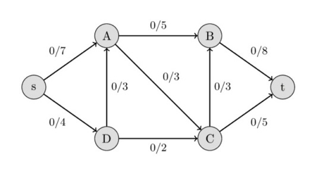
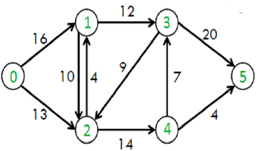

<h1 align="center">Edmonds Karp - Algorithm Implementation</h1>
<span>
    
    
    
</span>

Algorithm written for the subject Graph Theory related to the current course of study.

## Table of content
- [About the algorithm](#about-the-algorithm)
- [Example graphs](#example-graphs)
- [Input format](#input-format)
- [Installation](#installation)
- [Output](#output)

## About the algorithm
Edmonds-Karp algorithm is an implementation of the Ford-Fulkerson method that uses BFS for finding augmenting paths. Given a (network) graph which is just a set of verticies and directed edges with certain capacity. Algorithm tries to find maximum flow that can be pushed from the source to the sink.  
More info about the algorithm you can be found <a href="https://en.wikipedia.org/wiki/Edmonds%E2%80%93Karp_algorithm" target="_blank">here</a>. 

## Example graphs




## Input format
```json
0, 5
[[0, 16, 13,  0,  0,  0],
 [0,  0, 10, 12,  0,  0],
 [0,  4,  0,  0, 14,  0],
 [0,  0,  9,  0,  0, 20],
 [0,  0,  0,  7,  0,  4],
 [0,  0,  0,  0,  0,  0]]
```
Algorithm reads input from the file (with .txt extension) which should be put in to [`graphs`](https://github.com/jwozn2k/EdmondsKarp/tree/main/graphs) folder.  
Format of the file is as folows:  
- First two digits separated by a coma are number of a source and sink node in the network.
- Then 2D adjacency matrix that represents maximum capacity of the edge between two vertices. (Zero means that there is no edge between two nodes). 

## Installation
To try out the algorithm just download this github repository and save somewhere in your computer. Then go to the `EdmondsKarp` folder, open terminal and type:  
```console
$ python main.py
```
Program will ask for the name of the file to read from (simply type the name of the file with .txt extension):  
```
File name to read the input from: graph.txt
``` 

## Output
```
------AUGMENTED PATHS------
1 path: [0, 2, 4, 5]
2 path: [0, 2, 4, 3, 5]
3 path: [0, 1, 3, 5]
Maximum flow in this network:  23
```

Algorithm returns not only maximum flow in the given network but also augmented paths that were found during the execution of the program.


  
